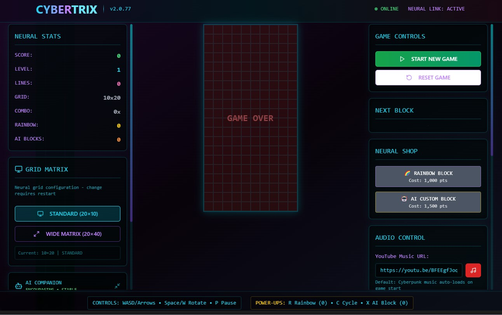

# -CyberTrix-

This is a full AI prompting project - to experiment using AI and controlling how AI can interact with functions and following instructions. 
A next-generation **Tetris-inspired game** built with **React, Vite, TypeScript, Tailwind CSS**, and the experimental **shadcn/ui** library.
This project is for learning, experimentation, and fun!
Explore new UI, AI chat, cyberpunk sound design, dynamic backgrounds, power-ups, and much more.

---

## Features

* **Modern Tetris Gameplay:**
  Play the core game with responsive keyboard & mobile touch controls.
* **Neural Shop & Power-Ups:**
  Earn points to buy special blocks (Rainbow, AI Custom, more!) for wild combos.
* **AI Chat Companion:**
  Get live feedback, encouragement, and strategy from a smart, sassy neural chatbot.
* **Dynamic Cyberpunk Sound & Music:**
  Cyberpunk-inspired SFX with in-browser synth + custom music (YouTube integration).
* **Retrowave & Custom Backgrounds:**
  Switch between retrowave, parallax, scanlines, and custom image backgrounds.
* **Mobile Ready:**
  Custom swipe/tap controls and UI that adapts on phones & tablets.
* **TypeScript Everywhere:**
  Modern, strongly typed code for safety and learning best practices.
* **Fun Experimental Blocks:**
  Discover legendary, rare, and AI-generated shapes and effects.
* **Beautiful Tailwind UI:**
  Built with shadcn/ui for modern, accessible design and easy theming.

---

## Preview




---

##  Tech Stack

| Tool/Library     | Usage                                      |
| ---------------- | ------------------------------------------ |
| **React**        | UI + state logic                           |
| **Vite**         | Ultra-fast dev/build                       |
| **TypeScript**   | Type safety everywhere                     |
| **Tailwind CSS** | Utility-first styling                      |
| **shadcn/ui**    | Beautiful, accessible component primitives |
| **lucide-react** | Iconography                                |

---

## 📁 Project Structure (Main Components)

```
src/
  ├── components/
  │     ├── TetrisGame.tsx        # Main game container (all logic/UI)
  │     ├── GameBoard.tsx         # Renders the main grid and pieces
  │     ├── GameSidebar.tsx       # Next block, neural shop, stats
  │     ├── GameHeader.tsx        # Title bar & status
  │     ├── AiChatCompanion.tsx   # AI chat UI + logic
  │     ├── GameControls.tsx      # On-screen WASD/Touch controls
  │     ├── GameShop.tsx          # Shop UI for special blocks
  │     ├── AudioManager.tsx      # Sound/music controls & SFX
  │     └── ...                   # More UI, helpers, hooks, types
```

---

## 🎮 Controls

**Keyboard:**

* Move: ← → or A/D
* Rotate: ↑ or W
* Soft Drop: ↓ or S
* Hard Drop: Spacebar
* Pause: P
* Reset: R
* Special Powers:

  * R = Use/Buy Rainbow Block
  * X = Use/Buy AI Custom Block
  * C/Space = Cycle Rainbow Shape (when active)

Mobile: <-- not fully implemented, as the new functions are not dynamic

* Swipe left/right: Move
* Swipe down: Soft drop
* Swipe up: Hard drop
* Tap: Rotate
* On-screen controls

---

## 🧠 AI Chat Companion

* **Modes:** Encouraging, Strategic, Teasing, Supportive
* **Comments:** Real-time feedback, block alerts, performance trends, fun trash talk!
* **Tips:** Triggers on special blocks, near-misses, combos, and more.

---

## 🛒 Neural Shop & Power-Ups

* **Rainbow Block:** Shape-shifting, wild-card Tetrimino (1000 pts)
* **AI Custom Block:** AI analyzes your board and gives you a clutch piece (1500 pts)
* **Advanced, Rare, Legendary Blocks:** Special bonuses and effects!

---

## 🔊 Sound & Music

* Custom synth SFX using browser AudioContext (cyberpunk-inspired!)
* YouTube music player for custom playlists (embed your own links)
* Mute and control via AudioManager panel

---

## 🖼️ Dynamic Backgrounds

* Retrowave gradient, parallax, scanlines, and more
* Upload or link your own image backgrounds
* Toggle effects live in the Options menu

---

## 📦 Getting Started

1. **Clone this repo:**

   ```bash
    gh repo clone ThiagoScheffer/cybertrix-react
  
   cd cybertrix-react
   ```

2. **Install dependencies:**

   ```bash
   npm install
   # or
   yarn
   ```

3. **Run in development:**

   ```bash
   npm run dev
   ```

4. **Open [http://localhost:5173](http://localhost:5173)** (or the port Vite tells you).

---

## 🏗️ For Learners & Hackers

* Modular, readable TypeScript components
* Hooks for game logic and SFX (`useTetrisGame`, `useSoundEffects`)
* Play with AI chat personalities and block algorithms
* Easy to extend with new power-ups, UI, or AI modes

---

## 🤝 Credits & Inspirations

* Tetris® — Classic game that inspired everything here
* [shadcn/ui](https://ui.shadcn.com/)
* [lucide-react](https://lucide.dev/)
* React, Vite, Tailwind, TypeScript, and you!

---

## 📜 License

MIT License.
**This project is for learning and fun — not for commercial use or monetization.**

---

## 💡 TODO / WISHLIST

* Add leaderboards (local or online)
* Save/load game state
* More AI chat modes (sarcastic, retro, etc)
* Twitch/OBS overlays?
* Multiplayer?! (one day...)

---

*Built for curiosity and experimentation. Make it yours!
PRs, forks, and ideas are welcome.
— \[Thiago Scheffer]

---

